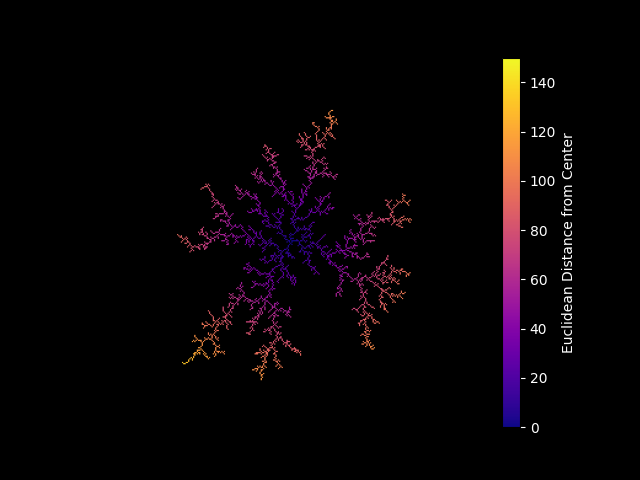

# Diffusion-Limited Aggregation (DLA)

## A Fractal Growth Model

## Diffusion-Limited Aggregation (DLA) Simulation

This project implements a Diffusion-Limited Aggregation (DLA). DLA was first visually demonstrated by physicists Thomas Witten and Leonard Sander in 1981, where they used computer simulations to explore the fractal-like patterns formed by particles diffusing and sticking together.

**Implementation Overview**:

The simulation initializes a 2D grid with a central seed where aggregation begins. Random walkers (particles) are introduced at a dynamically computed spawn radius and diffuse via random movement. When a particle reaches an occupied site, it sticks and becomes part of the growing structure. The process repeats, forming a fractal-like pattern.

**Key Steps**:

- **Grid Initialization**: A 2D NumPy array represents the simulation space, with a seed at the center.
- **Dynamic Particle Spawning**: New particles are spawned on a circle whose radius expands as the aggregate grows, ensuring efficient aggregation.
- **Particle Diffusion**: Walkers move randomly in the grid until they either stick to an occupied site or exit the valid simulation region.
- **Sticking Condition**: A particle attaches if it is adjacent to an existing structure.
- **Growth Visualization**: The final structure is visualized with a color gradient indicating the Euclidean distance from the seed.
- **Simulation Termination**: The process stops after the specified number of particles aggregate.

### Parameters

    radius = 100
    grid_size = 2 * radius + 1  # Twice the radius + 1 for center
    num_particles = 10000
    max_attempts = 100000
    spawn_radius_margin = 20

### Parameter Descriptions and Impact

- ***grid_size (2 * radius + 1)***: Defines the total size of the square grid. Larger values allow more detailed structures but increase computation time, while smaller values may cause premature boundary interactions.

- ***num_particles***: Determines the number of particles attempting to aggregate. Higher values yield a more developed fractal but require more computation. Too few particles may leave the structure incomplete.

- ***max_attempts***: Sets the maximum steps a particle can take before being discarded. This value is dynamically adjusted based on the distance from the center to the spawn radius. Higher values are used for particles spawned further out, increasing their chances of reaching the aggregate. Lower values may cause premature particle discarding, leading to incomplete structures.

- ***spawn_radius_margin***: Defines the buffer distance beyond the farthest aggregated particle for new particle spawning. A larger margin prevents excessive density but may cause particles to wander too far before attaching.

### Adjusting Parameters Together

- Increasing grid_size → Raise max_attempts and num_particles to support full structural development.

- Increasing num_particles → Ensure max_attempts is sufficient and consider lowering spawn_radius_margin to prevent excessive spread.

- Lowering max_attempts → May cause premature particle discarding, leading to incomplete structures.

- Raising spawn_radius_margin → Ensure max_attempts is high enough for distant particles to reach aggregation points.

### Visualization Settings

The colormap (plasma) enhances structure clarity with black for NaN values:

    map = plt.get_cmap("plasma")
    plasma_cmap.set_bad(color="black")  # NaN areas appear black

    # Visualization with adjusted vmax for Euclidean distances
    im = ax.imshow(dla_grid, cmap=plasma_cmap, origin="lower", vmin=0, vmax=grid_size // 2)
    cbar = plt.colorbar(im, ax=ax)
    cbar.set_label("Euclidean Distance from Center", color="white")
    cbar.ax.yaxis.set_tick_params(color="white")
    plt.setp(plt.getp(cbar.ax.axes, "yticklabels"), color="white")

- Experiment with colormaps like viridis, inferno, or magma for different contrasts.

- Ensure vmax is set meaningfully relative to grid_size for proper visualization.

- The animation stops when num_particles are reached, and progress is displayed using a status indicator.
